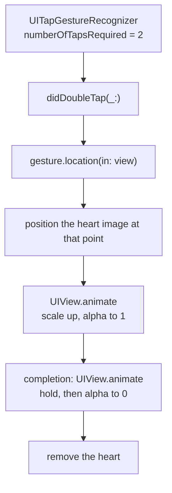

# Double Tap to Like

*The heart animation that appears where you double tap.*

    

## Overview

A double tap places a heart at the touch location, scales it up, holds briefly and fades it out. The detail that makes it feel right is that the heart appears under the finger rather than in the centre of the view.

## How it works



## Implementation notes

- **Location from the recogniser.** `location(in:)` gives the tap point in the view coordinate space, which is what anchors the heart to the finger.
- **Animations chained through completions.** The grow and the fade are separate blocks, so the hold between them is explicit rather than hidden in one long duration.
- **Transform rather than frame.** Scaling uses `CGAffineTransform`, which animates on the compositor and does not trigger layout.
- **The heart is transient.** It is created per tap and removed on completion, so rapid taps do not leave views behind.

## Project structure

```
DoubleTapLike/
└── ViewController.swift
```

## Requirements

Xcode 15 or later, iOS 17.5 or later. No external dependencies.
